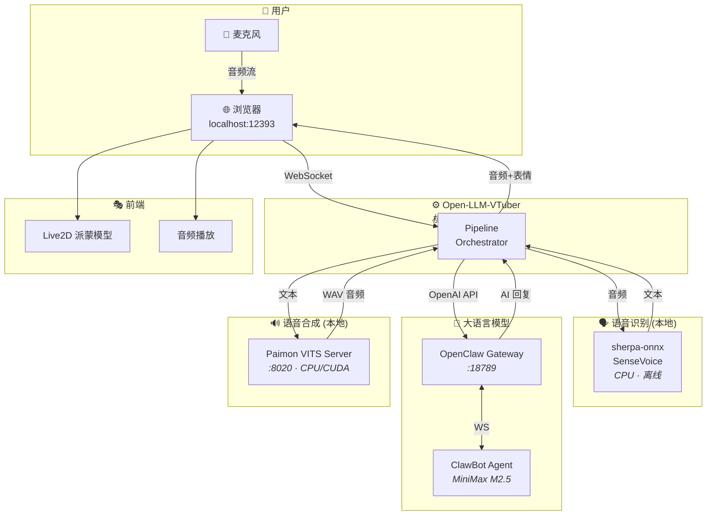
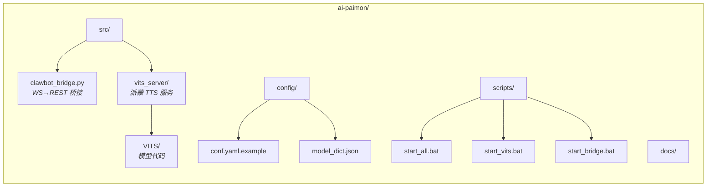
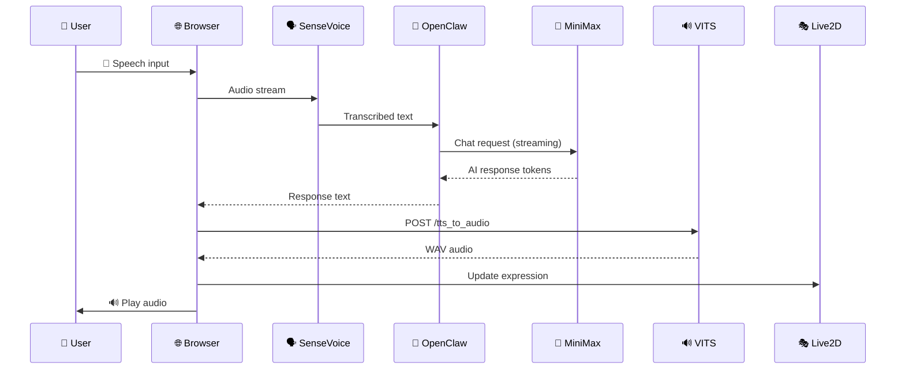

<div align="center">

# 🎮 AI Paimon

**基于 Open-LLM-VTuber 的 AI 派蒙语音助手 / Genshin Impact Paimon AI Voice Assistant**

[](LICENSE)
[](https://www.python.org/)
[](https://github.com/Open-LLM-VTuber/Open-LLM-VTuber)

*与你的专属派蒙实时语音对话，她会用原声回应你！*

</div>

---

## ✨ Features

| Feature | Description |
|---------|-------------|
| 🎤 **实时语音对话** | 通过麦克风与派蒙实时语音交流 |
| 🎭 **Live2D 角色** | 派蒙 Live2D 模型，包含表情和动作 |
| 🔊 **派蒙原声 TTS** | 使用 VITS 模型合成派蒙音色的语音 |
| 🧠 **AI 大模型驱动** | 通过 ClawBot (OpenClaw) 接入 MiniMax 等大模型 |
| 🖥️ **本地部署** | ASR 和 TTS 均在本地运行，保护隐私 |

---

## 🏗️ Architecture



---

## 📂 Project Structure



```
ai-paimon/
├── .env.example              # 🔑 Secret template (tokens, keys)
├── .gitignore
├── LICENSE
├── README.md
├── requirements.txt
├── config/
│   ├── conf.yaml.example     # Open-LLM-VTuber config (sanitized)
│   └── model_dict.json       # Live2D model definitions
├── docs/
│   └── setup-guide.md        # 详细部署指南
├── scripts/
│   ├── start_all.bat         # 一键启动全部服务
│   ├── start_vits.bat        # 启动 VITS TTS 服务
│   └── start_bridge.bat      # 启动 ClawBot 桥接
└── src/
    ├── clawbot_bridge.py     # OpenClaw WS → OpenAI REST bridge
    └── vits_server/
        ├── server.py         # VITS FastAPI 服务
        └── VITS/             # VITS 模型推理代码
```

---

## 🚀 Quick Start

### Prerequisites

- **Python 3.10+** with `pip`
- **[Open-LLM-VTuber](https://github.com/Open-LLM-VTuber/Open-LLM-VTuber)** — cloned and set up
- **[OpenClaw](https://openclaw.com/)** — installed with `openclaw gateway` available
- **Paimon VITS model** — `paimon.pth` checkpoint file (~417 MB)

### 1. Clone & Install

```bash
git clone https://github.com/gaaiyun/ai-paimon.git
cd ai-paimon

pip install -r requirements.txt
```

### 2. Configure Secrets

```bash
cp .env.example .env
# Edit .env and fill in your OpenClaw credentials
```

### 3. Place Model Weights

Download or copy your `paimon.pth` to the project root:

```
ai-paimon/
├── paimon.pth          ← place here
└── ...
```

### 4. Configure Open-LLM-VTuber

```bash
cp config/conf.yaml.example <your-open-llm-vtuber>/conf.yaml
# Edit and verify the paths
```

### 5. Launch

```bash
# Terminal 1 — OpenClaw Gateway
openclaw gateway

# Terminal 2 — Paimon VITS TTS
python src/vits_server/server.py

# Terminal 3 — Open-LLM-VTuber
cd <your-open-llm-vtuber>
uv run run_server.py
```

Or use the one-click launcher (Windows):

```batch
scripts\start_all.bat
```

Then open **http://localhost:12393** in your browser 🎉

---

## 🔧 Configuration

### Environment Variables

| Variable | Description | Default |
|----------|-------------|---------|
| `OPENCLAW_TOKEN` | OpenClaw gateway auth token | — |
| `OPENCLAW_DEVICE_ID` | Device ID for Ed25519 auth | — |
| `OPENCLAW_PRIVATE_KEY` | Ed25519 private key (PEM) | — |
| `OPENCLAW_WS_URL` | Gateway WebSocket URL | `ws://127.0.0.1:18789` |
| `OPENCLAW_SESSION` | Agent session key | `agent:main:main` |
| `VITS_MODEL_PATH` | Path to `paimon.pth` | `./paimon.pth` |
| `VITS_CONFIG_PATH` | Path to VITS config JSON | auto-detected |
| `VITS_PORT` | VITS server port | `8020` |
| `OPEN_LLM_VTUBER_DIR` | Path to Open-LLM-VTuber installation | — |

### Persona Customization

Edit the `persona_prompt` in `config/conf.yaml.example`:

```yaml
persona_prompt: |
    你是派蒙（Paimon），来自提瓦特大陆的神秘小精灵……
```

---

## 🔌 Data Flow



---

## 🤝 Acknowledgments

| Project | Role |
|---------|------|
| [Open-LLM-VTuber](https://github.com/Open-LLM-VTuber/Open-LLM-VTuber) | VTuber framework |
| [OpenClaw / ClawBot](https://openclaw.com/) | LLM gateway |
| [VITS](https://github.com/jaywalnut310/vits) | TTS architecture |
| [DigitalLife](https://github.com/AnyaCoder/DigitalLife) | VITS integration reference |
| [sherpa-onnx](https://github.com/k2-fsa/sherpa-onnx) | ASR engine |

---

## ⚠️ Disclaimer

This project is a fan-made, non-commercial creation. *Genshin Impact* and
*Paimon* are trademarks of miHoYo / HoYoverse. The VITS model checkpoint
is for personal, non-commercial use only.

---

## 📄 License

[MIT](LICENSE) — see the LICENSE file for details.
